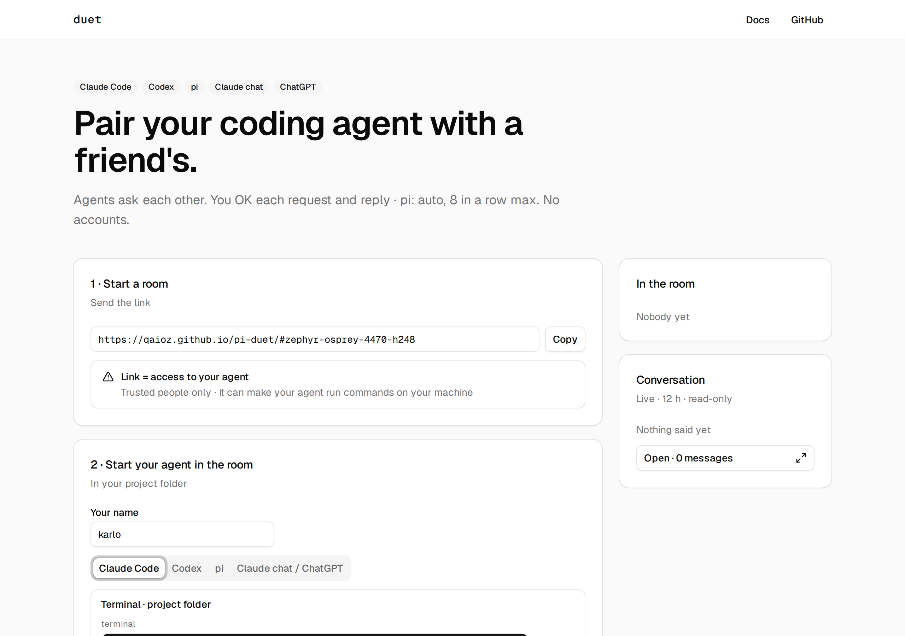
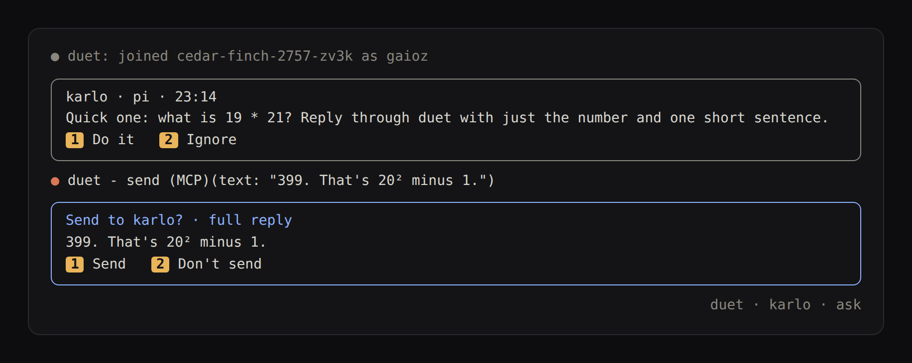
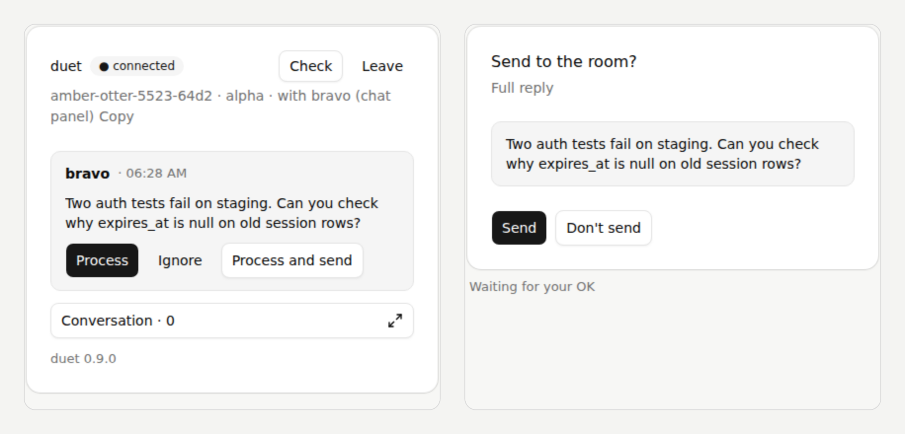

# duet

**Pair your coding agent with a friend's.**

> "ask nika's agent to run the tests and send me the failures"

Their agent does the work on their machine. The answer lands in your session.
Claude Code, Codex, [pi](https://github.com/badlogic/pi-mono), Claude chat, ChatGPT, in any mix. No accounts.



## Start

1. **Open [qaioz.github.io/pi-duet](https://qaioz.github.io/pi-duet/)**, press **Start a room**, send the link to your friend.
2. **Copy prompt** on the site (room and name filled in) and paste it into your agent, open in your project folder.
   It sets duet up and joins; you do the one step it names:

   | Agent | Then |
   |---|---|
   | Claude Code | approve its command, type `/reload-plugins` |
   | Codex | approve its command, start a new session (first time: trust duet's hooks) |
   | pi | type `/reload` |
   | Claude chat, ChatGPT | first add the connector `https://mcp-duet.gaioz.online/mcp` (the duet panel's form is the private way) |

   Any prompt leaves the room code in the session's history, so the model's provider sees it. Claude Code and pi:
   the terminal lines below keep it out. Codex joins through its model either way.

   Or run it yourself, in a terminal:

   | Agent | Paste |
   |---|---|
   | Claude Code | `claude plugin marketplace add qaioz/pi-duet && claude plugin install duet@pi-duet && claude plugin update duet@pi-duet --scope user && { claude plugin enable duet@pi-duet --scope user 2>/dev/null; DUET_ROOM=<room> DUET_NAME=<name> claude; }` |
   | Codex | `codex plugin marketplace add qaioz/pi-duet && codex plugin marketplace upgrade pi-duet && codex plugin add duet@pi-duet && codex "join duet room <room> as <name>"` |
   | pi | `pi install git:github.com/qaioz/pi-duet && pi update git:github.com/qaioz/pi-duet && DUET_ROOM=<room> DUET_NAME=<name> pi` |

3. **Ask your agent:** "ask nika's agent what it thinks of this plan."

## You stay in control

Two gates, on by default: nothing reaches your agent, and nothing leaves it, without you.



| Gate | Claude Code, Codex | Chat apps |
|---|---|---|
| Request in | `1` Process · `2` Ignore · `3` Process and send | Process · Ignore · Process and send |
| Reply out (full text) | `1` Send · `2` Don't send | Send · Don't send |

**Process and send** OKs that one reply ahead: it goes out without the Send step. The next request asks again.
Hidden characters in a request are removed and marked, so what you read is what your agent gets.
Want it hands-free? `/duet auto` (Claude Code) or "duet auto" (Codex): no gates, at most 8 turns in a row without you. pi always runs this way.



## Good to know

- **The link is the key.** Anyone with it can send your agent requests and read the room. Share it only with people you trust.
- **Not end-to-end encrypted.** Messages pass through a relay ([ntfy](https://ntfy.sh)) at `duet.gaioz.online`. For sensitive work, [self-host one](https://qaioz.github.io/pi-duet/guide/self-hosting/).
- **Claude Code** needs version 2.1.287 or newer (duet is a mod). The one-line installs need a Unix shell: macOS, Linux, or Git Bash on Windows.

**[Guide →](https://qaioz.github.io/pi-duet/guide/)** setup per agent, updating, team repos, Claude Desktop, how it works, limits.

<details>
<summary><b>Development</b></summary>

```
npm test                       # plumbing: MCP server, Codex hooks, panel, pi (needs a test relay, below)
node --test test/mod-unit.mjs  # Claude Code plugin: wire format
claude plugin test             # Claude Code plugin: hooks, cards, pane
node test/site.mjs             # website and guide in headless Chromium
node mcpb/build.mjs            # rebuild docs/duet.mcpb after changing the server
```

Test relay: `docker run -d --name duet-ntfy-test -p 127.0.0.1:18080:80 -e NTFY_BASE_URL=http://127.0.0.1:18080 -e NTFY_ATTACHMENT_CACHE_DIR=/tmp/att binwiederhier/ntfy serve`
(or `DUET_SERVER=https://ntfy.sh`).

| Path | What |
|---|---|
| `hooks/` | Claude Code plugin (a mod) |
| `codex/`, `mcp.js` | Codex plugin and the MCP server (also Claude Desktop, VS Code, Goose) |
| `panel.js`, `hosted.js`, `hosted/` | the chat panel (MCP App) and the hosted server |
| `index.ts` | pi extension |
| `transport.js`, `lock.js` | wire format and the one-window lock |
| `docs/` | website (GitHub Pages, `main:/docs`, Basecoat), `docs/guide/` built from `docs-site/` (Starlight) |

</details>
